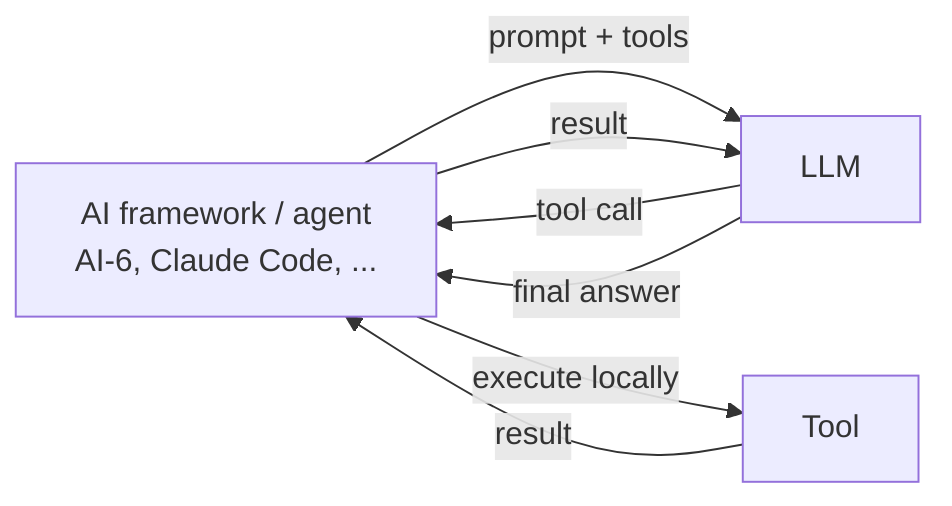
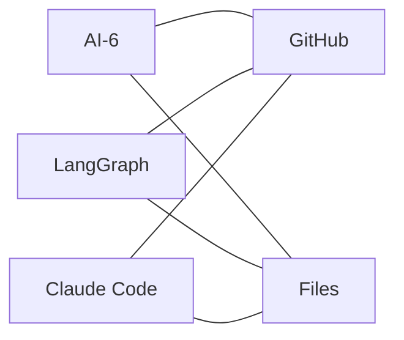
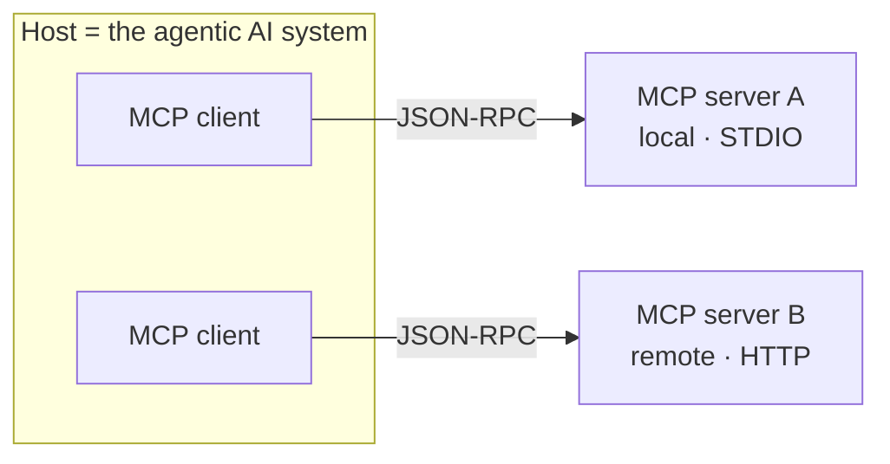
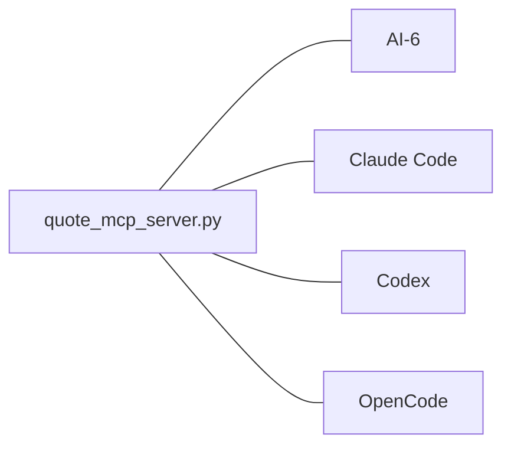

# Custom MCP Server Architecture
## for Personal AI Assistance

Gigi Sayfan · Summit.ai · July 21

<div class="abs-br m-6 text-sm opacity-60">
github.com/the-gigi/summit-ai-mcp-demo
</div>

<!--
One-line promise to plant now: build a tool once, use it in every assistant you own.
-->

---
layout: center
---

# Your assistant is only as good as the tools it can reach

An LLM on its own can talk. To *do* things it needs tools.

Today: build one tool **once** → use it in your own agent **and** Claude Code, Codex, OpenCode — no per-app glue.

<!--
This is the whole talk in one sentence. The "no per-app glue" is the payoff we cash in at §7.
-->

---

# Agenda

<div class="grid grid-cols-2 gap-x-8 text-lg leading-relaxed">

<div>

1. The agentic loop
2. What is MCP?
3. MCP vs CLI
4. What makes a good MCP server

</div>

<div>

5. **Build your own** — live
6. **Integrate everywhere** — live
7. Security & trust
8. Recap

</div>

</div>

<br>

<div class="opacity-70">Two live demos are the heart of it. Everything else sets them up.</div>

---
layout: section
---

# 1 · The agentic loop

---

# The agentic loop



<v-clicks>

- The **framework** owns the loop, the context, and the tools.
- The **LLM** decides *what* to call — it never runs anything itself.
- Tools run **locally**, with your permissions. (Remember this for §7.)

</v-clicks>

<!--
Stress: the model only emits a tool call. Execution is the framework's job, on your machine.
This is exactly the seam MCP standardizes.
-->

---

# Before MCP: every integration was bespoke

<div class="grid grid-cols-2 gap-8">

<div>

Each framework had its **own** tool format.

Each tool provider had to ship a wrapper **per framework**.

N frameworks × M tools = N×M integrations.

</div>

<div v-click>



<div class="text-center opacity-70 text-sm">tightly coupled, non-reusable</div>

</div>

</div>

<!--
Set up the pain MCP solves: fragmentation. Tools welded to frameworks.
-->

---
layout: section
---

# 2 · What is MCP?

---

# Model Context Protocol

An open standard (from Anthropic) for how agents and tools talk.

<v-clicks>

- Build a tool **once** against MCP → works with **any** MCP-aware host.
- N + M integrations instead of N × M.
- Language-agnostic. Servers in Python, TypeScript, Go, even bash.
- Versioned spec, negotiated per connection.

</v-clicks>

<div v-click class="mt-4 p-3 border rounded opacity-90">
Tool providers build once. Frameworks support MCP once. Everyone composes.
</div>

---

# Three roles



- **MCP host** — the agentic AI system / assistant (AI-6, Claude Code…). Owns the loop and context.
- **MCP client** — lives inside the host; one per server; speaks the protocol.
- **MCP server** — exposes the capabilities (tools); its own process, local or remote.

---

# Two layers

<div class="grid grid-cols-2 gap-8">

<div>

### Data layer
**JSON-RPC 2.0** messages.
Lifecycle, discovery, invocation, notifications.

The *what*.

</div>

<div>

### Transport layer
**STDIO** for local servers.
**Streamable HTTP** for remote.

The *how*.

</div>

</div>

<div v-click class="mt-6">

Same messages over either transport. Local server today → remote tomorrow,
no protocol change. (Useful: reach your personal tools from your phone.)

</div>

---

# Primitives — and our scope

<div class="grid grid-cols-2 gap-8">

<div>

MCP servers can expose:

- **Tools** — callable functions ✅
- Resources — readable context
- Prompts — reusable templates
- *MCP Apps* — interactive UI (new, Jan 2026)

</div>

<div v-click>

### We focus on **tools** only

- Resources are a poor man's RAG — expose as a tool if you need them.
- Prompts are an app concern, not the server's.
- Apps are exciting but out of scope today.

Tools are the 90% that matters.

</div>

</div>

<!--
This is the opinionated bit from the book. State it, don't dwell. Tools-only keeps the
mental model clean for the rest of the talk.
-->

---
layout: section
---

# 3 · MCP vs CLI

---

# MCP vs just giving the agent a CLI

| Aspect | CLI (`gh`, `kubectl`, `psql`) | MCP server |
|---|---|---|
| Discovery | Agent must know the commands | Self-describing: tools + schemas |
| Setup | Already on your machine | Build/install a server |
| Interface contract | Free-text args, easy to fumble | Typed input schema |
| Reuse across hosts | Re-explain per agent | Build once, plugs in everywhere |
| Best for | Quick, ad-hoc, rich existing tools | Stable, shared, typed capabilities |

<div v-click class="mt-4 opacity-90">

Not either/or. The CLI **is** the API for ad-hoc work. Reach for MCP when a
capability is **reused, typed, or shared** across assistants.

</div>

<!--
Gigi's "the CLI is the API" angle. Keep it to this one slide. Honest trade-offs build trust.
-->

---
layout: section
---

# 4 · What makes a good MCP server

---

# Design principles

<v-clicks>

- **Names & descriptions are prompts.** The LLM picks tools by reading them. Write for the model.
- **Right granularity.** One clear job per tool beats a kitchen-sink `do_everything(args)`.
- **Typed inputs.** Lean on the schema; don't make the model parse free text.
- **Predictable returns.** Decide text vs structured — and be consistent.
- **Handle the empty/error case.** Return *nothing* clearly, not a crash.
- **Stateless where you can.** Each call stands alone; easier to reason about and host.

</v-clicks>

<div v-click class="mt-4 opacity-80 text-sm">
The failure mode: a vague tool the LLM calls wrong, repeatedly. (We'll see one done right next.)
</div>

---
layout: section
---

# 5 · Build your own
### live

---

# The demo: a quote server

A curated list of quotes by category. Two tools:

| Tool | Input | Returns |
|---|---|---|
| `list_categories` | — | the categories that have quotes |
| `get_quote` | `category` | a random quote, or **nothing** if none |

<div class="mt-4 opacity-80">

Tiny on purpose — so the *architecture* is the lesson, not the domain.

</div>

---

# The data

`quotes.json` — categories → quotes.

```json {all|2-5}
{
  "stoicism": [
    { "text": "We suffer more often in imagination than in reality.", "author": "Seneca" }
  ],
  "engineering": [
    { "text": "Simplicity is prerequisite for reliability.", "author": "Dijkstra" }
  ]
}
```

---

# The server — that's the whole thing

```python {all|1-3|5-6|8-11|13-21}
import json, os, random
from pathlib import Path
from mcp.server.fastmcp import FastMCP

# quiet logs so host output stays clean
mcp = FastMCP("Quotes", log_level="WARNING")

@mcp.tool()
def list_categories() -> str:
    """List the categories that have at least one quote, comma-separated."""
    return ", ".join(sorted(_load_quotes().keys()))

@mcp.tool()
def get_quote(category: str) -> str:
    """Return a random quote for the category. Empty string if unknown/empty."""
    entries = _load_quotes().get(category.strip().lower(), [])
    if not entries:                 # the empty case, handled
        return ""
    q = random.choice(entries)
    return f"“{q['text']}” — {q['author']}"

if __name__ == "__main__":
    mcp.run()                       # STDIO transport
```

<!--
Point at the design principles live: docstrings ARE the descriptions the LLM reads;
typed `category: str`; empty string is the clean "nothing" case; stateless.
-->

---

# Test it — no LLM, no browser

`try_server.py` speaks MCP to the server over STDIO:

```bash
uv run python try_server.py
```

```text {2-4}
Tools: list_categories, get_quote
Categories: creativity, engineering, humor, motivation, stoicism
A stoic quote: “We suffer more often in imagination than in reality.” — Seneca
Unknown category 'banana': '' (nothing, as expected)
```

<div v-click class="mt-2 opacity-90">

Or the **MCP Inspector** for a UI:
`npx @modelcontextprotocol/inspector --config .mcp.json --server quotes`

</div>

<!--
Live: run try_server.py. Then optionally show the Inspector connected.
-->

---
layout: section
---

# 6 · Integrate everywhere
### live · the payoff

---

# Same server. Four hosts. Zero changes.

<div class="text-lg">

The server we just wrote — unchanged — now plugs into each assistant.

</div>



<div v-click class="mt-2 opacity-80">Build once. Run everywhere. This is the promise, made real.</div>

---

# AI-6 — one config line

`ai6/config.yaml`:

```yaml {4-5}
default_model_id: gpt-5
tools_dirs:
  - ${DEMO_DIR}/ai6/native_tools
mcp_tools_dirs:
  - ${DEMO_DIR}/quote_server     # ← scans, launches, discovers tools
enabled_tools: [list_categories, get_quote]
```

```bash
uv run python ai6/quote_assistant.py
```

```text {2-3}
👤 give me a stoic quote
  🔧 list_categories() -> creativity, engineering, humor, ...
  🔧 get_quote(category='stoicism') -> “Waste no more time...” — Marcus Aurelius
```

<!--
Works with OpenAI and with a local Ollama model (gpt-oss:20b) — no API key path.
-->

---

# Claude Code & Codex — one command each

### Claude Code

```bash
claude mcp add quotes --scope project \
  -- uv --directory ~/git/summit-ai-mcp-demo run python quote_server/quote_mcp_server.py
```

writes a `.mcp.json` → `/mcp` to see it, then *"give me a quote about creativity."*

### Codex

```bash
codex mcp add quotes \
  -- uv --directory ~/git/summit-ai-mcp-demo run python quote_server/quote_mcp_server.py
```

writes `~/.codex/config.toml` → `codex mcp list` to verify.

---

# OpenCode — a project config file

`opencode.json`:

```json {3-7}
{
  "$schema": "https://opencode.ai/config.json",
  "mcp": {
    "quotes": {
      "type": "local",
      "command": ["uv", "--directory", "<repo>", "run", "python", "quote_server/quote_mcp_server.py"],
      "enabled": true
    }
  }
}
```

```bash
opencode mcp list      # ✓ quotes connected
```

<div v-click class="mt-3 text-lg">

Four hosts, four flavors of config — **one unchanged server**.

</div>

---
layout: section
---

# 7 · Security & trust

---

# An MCP server runs with *your* permissions

<v-clicks>

- A local server you launch can read your files, hit your network, spend your tokens.
- `npx some-mcp-server` = running a stranger's code as you. **Vet before you wire it in.**
- **Secrets**: pass via env/config, don't bake into the server or logs.
- **Prompt injection**: a tool *result* is untrusted input — a malicious page/file can carry instructions the model may follow.
- MCP Apps add UI → sandboxed iframes, pre-declared templates, user consent.

</v-clicks>

<div v-click class="mt-4 p-3 border rounded opacity-90">
Personal AI assistance means wiring tools into your real life. Trust is part of the architecture.
</div>

---
layout: center
class: text-center
---

# Build once. Run everywhere.

One ~65-line server → your agent **and** Claude Code, Codex, OpenCode.

<div class="mt-6 opacity-90">

📦 **github.com/the-gigi/summit-ai-mcp-demo** — code + `WALKTHROUGH.md`
📖 *Design Multi-Agent AI Systems Using MCP* — ch. 7

</div>

<div class="mt-8 text-2xl">Questions?</div>

<!--
Land the promise. Point at the repo (reproducible) and the book. Open for Q&A.
-->
